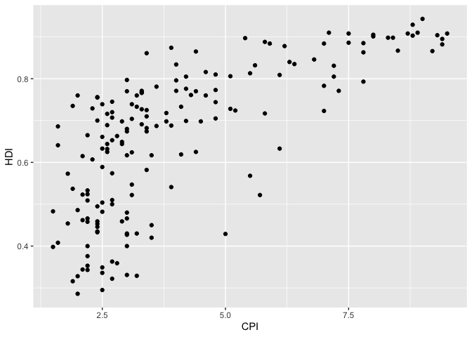
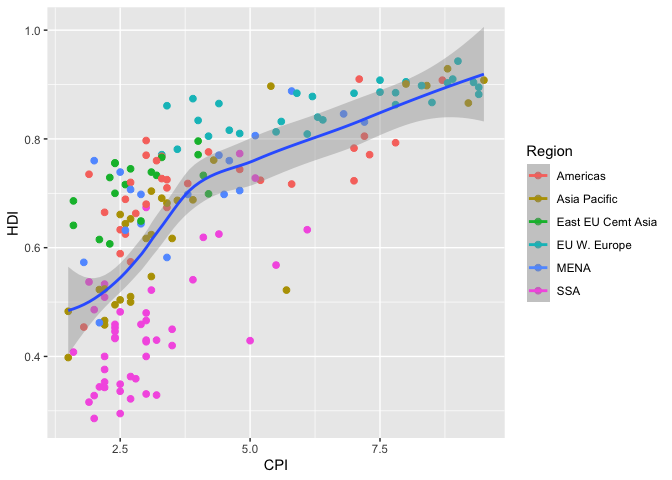
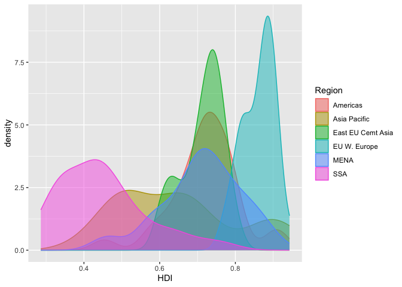
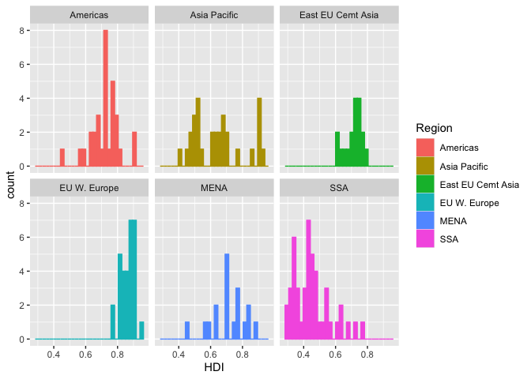
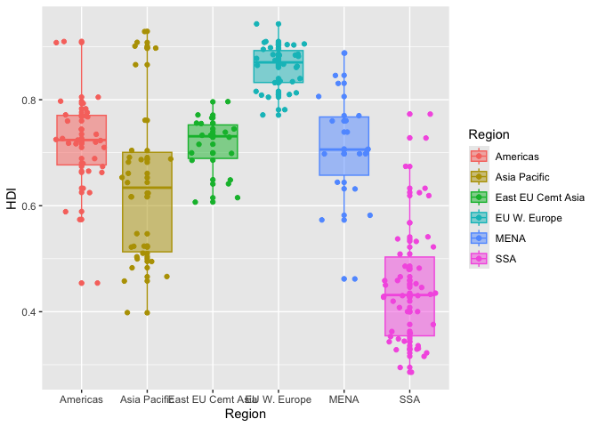
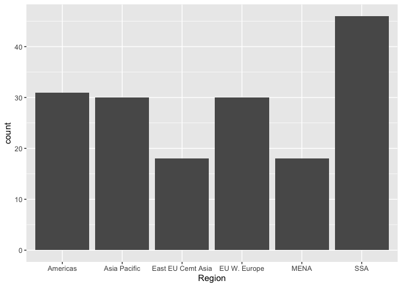

# Assignment 4

 
# Assignment 4: Data transformation and visualization

## Load packages

To start, load all the required packages with the following code.
Install them if they are not installed yet.

``` r
library(tidyverse)
library(knitr)
```

## Exercise 1. Corruption and human development

This exercise explores a dataset containing the human development index
(`HDI`) and corruption perception index (`CPI`) of 173 countries across
6 different regions around the world: Americas, Asia Pacific, Eastern
Europe and Central Asia (`East EU Cemt`), Western Europe
(`EU W. Europe`), Middle East and North Africa and Noth Africa (`MENA`),
and Sub-Saharan Africa (`SSA`). (Note: the larger `CPI` is, the less
corrupted the country is perceived to be.)

First, we load the data using the following code.

``` r
economist_data <- read_csv("https://raw.githubusercontent.com/nt246/NTRES-6100-data-science/master/datasets/EconomistData.csv")
```

    New names:
    Rows: 173 Columns: 6
    ── Column specification
    ──────────────────────────────────────────────────────── Delimiter: "," chr
    (2): Country, Region dbl (4): ...1, HDI.Rank, HDI, CPI
    ℹ Use `spec()` to retrieve the full column specification for this data. ℹ
    Specify the column types or set `show_col_types = FALSE` to quiet this message.
    • `` -> `...1`

#### 1.1 Show the first few rows of `economist_data`.

``` r
head(economist_data)
```

    # A tibble: 6 × 6
       ...1 Country     HDI.Rank   HDI   CPI Region           
      <dbl> <chr>          <dbl> <dbl> <dbl> <chr>            
    1     1 Afghanistan      172 0.398   1.5 Asia Pacific     
    2     2 Albania           70 0.739   3.1 East EU Cemt Asia
    3     3 Algeria           96 0.698   2.9 MENA             
    4     4 Angola           148 0.486   2   SSA              
    5     5 Argentina         45 0.797   3   Americas         
    6     6 Armenia           86 0.716   2.6 East EU Cemt Asia

#### 1.2 Explore the relationship between human development index (`HDI`) and corruption perception index (`CPI`) with a scatter plot as the following.

``` r
economist_data |> 
ggplot(mapping = aes(x = CPI, y = HDI)) + 
  geom_point()
```



#### 1.3 Make the color of all points in the previous plot red.

``` r
economist_data |> 
ggplot(mapping = aes(x = CPI, y = HDI)) + 
  geom_point(color = "red")
```


#### 1.4 Color the points in the previous plot according to the `Region` variable, and set the size of points to 2.

``` r
economist_data |> 
ggplot(mapping = aes(x = CPI, y = HDI, color = Region)) + 
  geom_point(size = 2)
```


#### 1.5 Set the size of the points proportional to `HDI.Rank`

``` r
economist_data |> 
ggplot(mapping = aes(x = CPI, y = HDI, color = Region, size = HDI.Rank)) + 
  geom_point() 
```


#### 1.6 Fit a **smoothing line** to **all** the data points in the scatter plot from Exercise 1.4

``` r
economist_data |> 
ggplot(mapping = aes(x = CPI, y = HDI, color = Region)) + 
  geom_point(size = 2) + 
  geom_smooth(aes(color = NULL))
```

    `geom_smooth()` using method = 'loess' and formula = 'y ~ x'



#### 1.7 Fit a separate **straight line** for **each region** instead, and turn off the confidence interval.

``` r
economist_data |> 
ggplot(mapping = aes(x = CPI, y = HDI, color = Region)) + 
  geom_point() + 
  geom_smooth(method = lm, se = FALSE)
```

    `geom_smooth()` using formula = 'y ~ x'


#### 1.8 Building on top of the previous plot, show each `Region` in a different facet.

``` r
economist_data |> 
ggplot(mapping = aes(x = CPI, y = HDI, color = Region)) + 
  geom_point() + 
  geom_smooth(method = lm, se = FALSE) + 
  facet_wrap("Region")
```

    `geom_smooth()` using formula = 'y ~ x'


#### 1.9 Show the distribution of `HDI` in each region using density plot. Set the transparency to 0.5

``` r
economist_data |> 
ggplot(mapping = aes(x = HDI, color = Region, fill= Region)) + 
  geom_density(alpha = 0.5)
```



#### 1.10 Show the distribution of `HDI` in each region using histogram and facetting.

``` r
economist_data |> 
ggplot(mapping = aes(x = HDI, color = Region, fill= Region)) + 
  geom_histogram() +
  facet_wrap(~ Region)
```

    `stat_bin()` using `bins = 30`. Pick better value with `binwidth`.



#### 1.11 Show the distribution of `HDI` in each region using a box plot. Set the transparency of these boxes to 0.5 and do not show outlier points with the box plot. Instead, show all data points for each country in the same plot. (Hint: `geom_jitter()` or `position_jitter()` might be useful.)

``` r
economist_data |> 
ggplot(mapping = aes(x = Region, y = HDI, color = Region, fill= Region)) + 
  geom_boxplot(alpha = 0.5) + 
  geom_point() + 
  geom_jitter()
```



#### 1.12 Show the count of countries in each region using a bar plot.

``` r
economist_data |> 
ggplot(mapping = aes(x = Region)) + geom_bar() 
```



#### 1.13 You have now created a variety of different plots of the same dataset. Which of your plots do you think are the most informative? Describe briefly the major trends that you see in the data.

Answer: I think the most informative plots are the ones using
facet_wrap, where the variables are visually broken out. The density
plot also provides a really nice visual. There is certainly variability
in the data, and I’d expect there to be some statistically significant
differences.

## Exercise 2. Theophylline experiment

This exercise uses the `Theoph` data frame (comes with your R
installation), which has 132 rows and 5 columns of data from an
experiment on the pharmacokinetics of the anti-asthmatic drug
theophylline. Twelve subjects were given oral doses of theophylline then
serum concentrations were measured at 11 time points over the next 25
hours. You can learn more about this dataset by running `?Theoph`

Have a look at the data structure

``` r
kable(head(Theoph))
```

| Subject |   Wt | Dose | Time |  conc |
|:--------|-----:|-----:|-----:|------:|
| 1       | 79.6 | 4.02 | 0.00 |  0.74 |
| 1       | 79.6 | 4.02 | 0.25 |  2.84 |
| 1       | 79.6 | 4.02 | 0.57 |  6.57 |
| 1       | 79.6 | 4.02 | 1.12 | 10.50 |
| 1       | 79.6 | 4.02 | 2.02 |  9.66 |
| 1       | 79.6 | 4.02 | 3.82 |  8.58 |

``` r
head(Theoph)
```

    Grouped Data: conc ~ Time | Subject
      Subject   Wt Dose Time  conc
    1       1 79.6 4.02 0.00  0.74
    2       1 79.6 4.02 0.25  2.84
    3       1 79.6 4.02 0.57  6.57
    4       1 79.6 4.02 1.12 10.50
    5       1 79.6 4.02 2.02  9.66
    6       1 79.6 4.02 3.82  8.58

``` r
summary(Theoph)
```

        Subject         Wt             Dose            Time             conc       
     6      :11   Min.   :54.60   Min.   :3.100   Min.   : 0.000   Min.   : 0.000  
     7      :11   1st Qu.:63.58   1st Qu.:4.305   1st Qu.: 0.595   1st Qu.: 2.877  
     8      :11   Median :70.50   Median :4.530   Median : 3.530   Median : 5.275  
     11     :11   Mean   :69.58   Mean   :4.626   Mean   : 5.895   Mean   : 4.960  
     3      :11   3rd Qu.:74.42   3rd Qu.:5.037   3rd Qu.: 9.000   3rd Qu.: 7.140  
     2      :11   Max.   :86.40   Max.   :5.860   Max.   :24.650   Max.   :11.400  
     (Other):66                                                                    

For the following exercise, **transform the data as instructed**. Try to
use `tidyverse` functions even if you are more comfortable with base-R
solutions. Show the **first 6 lines** of the transformed data in a table
through RMarkdown **using the kable() function**, as shown above.

#### 2.1 Select columns that contain a lower case “t” in the `Theoph` dataset. Do not manually list all the columns to include.

``` r
theoph_t <- Theoph |> 
  select(contains("t")) 

kable(head(theoph_t))
```

| Subject |   Wt | Time |
|:--------|-----:|-----:|
| 1       | 79.6 | 0.00 |
| 1       | 79.6 | 0.25 |
| 1       | 79.6 | 0.57 |
| 1       | 79.6 | 1.12 |
| 1       | 79.6 | 2.02 |
| 1       | 79.6 | 3.82 |

#### 2.2 Rename the `Wt` column to `Weight` and `conc` column to `Concentration` in the `Theoph` dataset.

``` r
theoph_rename <- Theoph |> 
  rename(Weight = Wt, Concentration = conc)

kable(head(theoph_rename))
```

| Subject | Weight | Dose | Time | Concentration |
|:--------|-------:|-----:|-----:|--------------:|
| 1       |   79.6 | 4.02 | 0.00 |          0.74 |
| 1       |   79.6 | 4.02 | 0.25 |          2.84 |
| 1       |   79.6 | 4.02 | 0.57 |          6.57 |
| 1       |   79.6 | 4.02 | 1.12 |         10.50 |
| 1       |   79.6 | 4.02 | 2.02 |          9.66 |
| 1       |   79.6 | 4.02 | 3.82 |          8.58 |

#### 2.3 Extract the `Dose` greater than 4.5 and `Time` greater than the mean `Time`.

``` r
theoph_extract <- Theoph |> 
  filter(Dose > 4.5, Time > mean(Time))
    
kable(head(theoph_extract))
```

| Subject |   Wt | Dose |  Time | conc |
|:--------|-----:|-----:|------:|-----:|
| 3       | 70.5 | 4.53 |  7.07 | 5.30 |
| 3       | 70.5 | 4.53 |  9.00 | 4.90 |
| 3       | 70.5 | 4.53 | 12.15 | 3.70 |
| 3       | 70.5 | 4.53 | 24.17 | 1.05 |
| 5       | 54.6 | 5.86 |  7.02 | 7.09 |
| 5       | 54.6 | 5.86 |  9.10 | 5.90 |

#### 2.4 Sort the `Theoph` dataset by `Wt` from smallest to largest and secondarily by Time from largest to smallest.

``` r
theoph_sort <- Theoph |> 
  arrange(-Time) |> 
  arrange(Wt) 
    
kable(head(theoph_sort))
```

| Subject |   Wt | Dose |  Time | conc |
|:--------|-----:|-----:|------:|-----:|
| 5       | 54.6 | 5.86 | 24.35 | 1.57 |
| 5       | 54.6 | 5.86 | 12.00 | 4.37 |
| 5       | 54.6 | 5.86 |  9.10 | 5.90 |
| 5       | 54.6 | 5.86 |  7.02 | 7.09 |
| 5       | 54.6 | 5.86 |  5.02 | 7.56 |
| 5       | 54.6 | 5.86 |  3.50 | 8.74 |

#### 2.5 Create a new column called `Quantity` that equals to `Wt` x `Dose` in the `Theoph` dataset. This will tell you the absolute quantity of drug administered to the subject (in mg). Replace the `Dose` variable with `Quantity`.

``` r
theoph_col <- Theoph |> 
  mutate(Quantity = Wt*Dose) |> 
  select(-Dose)
    
kable(head(theoph_col))
```

| Subject |   Wt | Time |  conc | Quantity |
|:--------|-----:|-----:|------:|---------:|
| 1       | 79.6 | 0.00 |  0.74 |  319.992 |
| 1       | 79.6 | 0.25 |  2.84 |  319.992 |
| 1       | 79.6 | 0.57 |  6.57 |  319.992 |
| 1       | 79.6 | 1.12 | 10.50 |  319.992 |
| 1       | 79.6 | 2.02 |  9.66 |  319.992 |
| 1       | 79.6 | 3.82 |  8.58 |  319.992 |

#### 2.6 Find the mean `conc` and sum of the `Dose` received by each test subject.

Show data for the 6 subjects with the smallest sum of `Dose` as below.
**Do not define new intermediate objects for this exercise; use pipes to
chain together functions.**

``` r
theoph_calcs <- Theoph |> 
  mutate(mean = mean(conc) + Dose) |> 
  arrange(-Dose) |> 
  head(6)


  kable(head(theoph_calcs))
```

| Subject |   Wt | Dose | Time |  conc |     mean |
|:--------|-----:|-----:|-----:|------:|---------:|
| 5       | 54.6 | 5.86 | 0.00 |  0.00 | 10.82045 |
| 5       | 54.6 | 5.86 | 0.30 |  2.02 | 10.82045 |
| 5       | 54.6 | 5.86 | 0.52 |  5.63 | 10.82045 |
| 5       | 54.6 | 5.86 | 1.00 | 11.40 | 10.82045 |
| 5       | 54.6 | 5.86 | 2.02 |  9.33 | 10.82045 |
| 5       | 54.6 | 5.86 | 3.50 |  8.74 | 10.82045 |

## Exercise 3. Unemployment in the US 1967-2015 (**OPTIONAL**)

This excercise uses the dataset `economics` from the ggplot2 package. It
was produced from US economic time series data available from
<http://research.stlouisfed.org/fred2>. It descibes the number of
unemployed persons (`unemploy`), among other variables, in the US from
1967 to 2015.

    head(economics) %>% kable()

| date       |   pce |    pop | psavert | uempmed | unemploy |
|:-----------|------:|-------:|--------:|--------:|---------:|
| 1967-07-01 | 506.7 | 198712 |    12.6 |     4.5 |     2944 |
| 1967-08-01 | 509.8 | 198911 |    12.6 |     4.7 |     2945 |
| 1967-09-01 | 515.6 | 199113 |    11.9 |     4.6 |     2958 |
| 1967-10-01 | 512.2 | 199311 |    12.9 |     4.9 |     3143 |
| 1967-11-01 | 517.4 | 199498 |    12.8 |     4.7 |     3066 |
| 1967-12-01 | 525.1 | 199657 |    11.8 |     4.8 |     3018 |

#### 3.1 Plot the trend in number of unemployed persons (`unemploy`) though time using the economics dataset shown above. And for this question only, **hide your code and only show the plot**.

``` r
## Write your code here
```

#### 3.2 Edit the plot title and axis labels of the previous plot appropriately. Make y axis start from 0. Change the background theme to what is shown below. (Hint: search for help online if needed)

``` r
## Write your code here
```
